# ESTUDO DE CASO - ORGANIZAÇÃO

## DESCRIÇÃO DA ATIVIDADE

O caso de uma empresa industrial com produtos de alta precisão.

Vamos estudar o caso real de uma empresa industrial, ao montar uma estrutura organizacional adequada às suas circunstâncias (algumas peculiaridades da empresa foram decisivas na escolha da solução).

**Informações gerais**.
Uma empresa industrial produz equipamentos mecânicos especializados, de alta precisão, em lotes médios e pequenos, para uso em indústrias de mineração, prospecção de petróleo, abertura de poços artesianos e indústrias de bens de capital. Trata-se de uma sociedade anônima de capital fechado, em que os acionistas, em número de três, possuem também uma empresa de representação que vende boa parte dos produtos dessa empresa industrial, além dos produtos de outras empresas similares, nas estrangeiras. Nessa empresa de representação, os acionistas têm, pela sua vocação comercial, atuação pessoal destacada.

Os equipamentos usados na fabricação são ferramentas versáteis de fabricação mecânica, como equipamentos de usinagem: tornos, fresadoras, plainas, furadeiras e madrilhadeiras, bem como equipamentos de caldeiraria: calandras e máquinas de solda e equipamentos de forjaria: prensas e máquinas de estamparia.

A empresa produz muitas peças e conjuntos de peças, por meio de contratos de fabricação para produção por encomenda, com cláusulas de reajuste de preço mais ou menos complexas. Fabricam-se muitas variedades de peças, conjuntos de peças e equipamentos mecânicos, todos de alta precisão. Trata-se de produtos com tecnologia nova e em constante evolução.

O faturamento é de 400 milhões de reais por ano, sendo o custo da matéria-prima e dos componentes comprados 200 milhões de reais por ano. O número de funcionários é de 1500, dos quais 90% na produção, que é concentrada em uma única fábrica, com área de 40000 m².

O mercado é altamente favorável: há grande demanda pelos produtos da empresa, que não consegue supri-la totalmente. Não há perspectiva de mudança do mercado nos próximos dois anos, sendo impossível qualquer previsão além desse prazo. Apesar de sucessivas expansões, a produção não tem conseguido atender às vendas. A carteira de pedidos oscila entre 4 e 5 meses de produção.

O patrimônio líquido da empresa é apenas 40 milhões de reais, exigindo o uso de intensos empréstimos e financiamentos. O custo dos recursos humanos não é alto em comparação com o das matérias-primas e componentes comprados.

A empresa vende principalmente para grandes clientes. As vendas são feitas para grandes usuários finais e para atacadistas. Fico clientes respondem por 80% da carteira de pedidos, sendo que um deles tem 40% da carteira.  A margem líquida sobre o faturamento é 5%. O lucro líquido anual sobre o patrimônio líquido é 50%.

Dois terços são fabricados sob licença de empresas estrangeiras, mas, em muitos casos, têm de ser adaptados às condições de operação e de fabricação do país. Em qualquer caso, os produtos têm que ser redesenhados antes de serem fabricados. Um terço dos produtos são pesquisados, desenvolvidos e projetados na própria empresa.

**Listagem das principais atividades**. Foram identificadas, como necessárias para o funcionamento da empresa, as seguintes atividades:

1. formulação e aprovação das políticas;
2. ferramentaria(gabaritos, dispositivos de fixação de peças, ferramentas, matrizes e acessórios de fabricação);
3. especificação de processos e tempos de produção;
4. arquivo técnico dos desenhos;
5. operações de fabricação: usinagem;
6. operações de fabricação: caldeiraria;
7. operações de fabricação: forjaria;
8. compras de materiais de escritório;
9. serviços de informática;
10. compras de matéria-prima;
11. recrutamento de seleção pessoal;
12. avaliação de pessoal;
13. treinamento;
14. contabilidade geral;
15. aplicações financeiras;
16. descontos de duplicatas;
17. operações de financiamento;
18. pesquisa e desenvolvimento de produtos;
19. auditoria interna;
20. contabilidade fiscal;
21. programação financeira;
22. relacionamento com bancos;
23. orçamentação e custos de produtos já fabricados;
24. compras de equipamentos para a produção;
25. seguros;
26. auditoria externa;
27. serviços de portaria e vigilância;
28. projetos de novos produtos;
29. normalização e especificação dos produtos;
30. serviços de limpeza;
31. programação de produção;
32. controle físico do estoque;
33. restaurantes;
34. manutenção das instalações fabris;
35. prevenção de acidentes e CIPAS;
36. operação e manutenção das redes industriais de ar comprimido, energia elétrica, telefone, água, gás, esgotos, proteção contra incêndio, vapor e óleo comprimido para os cilindros hidráulicos;
37. controle de contas a pagar;
38. controle de qualidade do produto acabado;
39. segurança patrimonial;
40. compras de material de limpeza;
41. armazenagem de matéria-prima;
42. armazenagem de produtos em processamento;
43. serviços jurídicos;
44. armazenagem de produtos acabados;
45. operações de pagamentos;
46. controle de qualidade da matéria-prima;
47. manutenção dos equipamentos de produção;
48. serviços médicos;
49. planejamento e normas de manutenção;
50. mesa telefônica;
51. orçamentação de novos produtos;
52. registro do pessoal;
53. processamento da folha de pagamento;
54. faturamento e cobrança;
55. cópia de documentos;
56. analise dos resultados contábeis;
57. pesquisa do mercado e quantificação da demanda;
58. manutenção de equipamentos de escritório;
59. vendas;
60. transporte do pessoal;
61. transporte dos produtos acabados para os clientes;
62. controle de qualidade ao longo do processo de fabricação;
63. serviço social;
64. elaboração de normas de procedimentos;
65. estáticas de pessoal;
66. armazenagem do material de limpeza;
67. contatos e visitas a clientes atuais e potenciais;
68. simplificação das rotinas;
69. especificação das rotinas de fabricação;
70. controle de produção;
71. controle de produtividade dos meios de produção;
72. aprovação do orçamento geral da empresa.

Pede-se: estabelecer uma estrutura organizacional que atenda às características da empresa descrita anteriormente, com o nível de detalhe possível  formalizando-a por meio de um organograma clássico. Além disso, pede-se que se justifique a estrutura proposta explicando as razões da solução encontrada nas diversas áreas e níveis.

Note que a relação das atividades não deve ser usada como base para a montagem da estrutura, pois se constitui em simples orientação para verificar, no final, ao se fazer o detalhamento dos órgãos, se ficou faltando algum órgão ou atividade importante. As atividades listadas podem não constar da estrutura da proposta, nem precisam, necessariamente, corresponder a um órgão. Diferentes atividades poderão se combinar em uma única unidade, da mesma forma que uma atividade básica determinada poderá se desdobrar, formando vários órgãos. Se necessário, novas atividades podem ser acrescentadas.

## ESTRUTURA ORGANIZACIONAL

```mermaid
graph LR
    A[Assembleia de Acionistas] --> B[Conselho de Administração]
    B --> C[Diretoria Executiva]
    
    C --> D[Diretoria Industrial]
    C --> E[Diretoria Comercial]
    C --> F[Diretoria Financeira]
    C --> G[Diretoria de Engenharia e P&D]
    
    D --> D1[Gerência de Produção]
    D --> D2[Gerência de Qualidade]
    D --> D3[Gerência de Manutenção]
    D --> D4[Gerência de Suprimentos]
    
    D1 --> D1A["Setor de Usinagem<br/>Ativ: 5"]
    D1 --> D1B["Setor de Caldeiraria<br/>Ativ: 6"]
    D1 --> D1C["Setor de Forjaria<br/>Ativ: 7"]
    D1 --> D1D["Ferramentaria<br/>Ativ: 2"]
    D1 --> D1E["Programação e Controle<br/>Ativ: 3, 31, 69, 70, 71"]
    
    D2 --> D2A["Controle de Qualidade - Matéria Prima<br/>Ativ: 46"]
    D2 --> D2B["Controle de Qualidade - Processo<br/>Ativ: 62"]
    D2 --> D2C["Controle de Qualidade - Produto Final<br/>Ativ: 38"]
    
    D3 --> D3A["Manutenção Preventiva<br/>Ativ: 49"]
    D3 --> D3B["Manutenção Corretiva<br/>Ativ: 47"]
    D3 --> D3C["Manutenção de Instalações<br/>Ativ: 34, 36"]
    
    D4 --> D4A["Compras de Matéria-Prima<br/>Ativ: 10"]
    D4 --> D4B["Compras de Equipamentos<br/>Ativ: 8, 24, 25, 40"]
    D4 --> D4C["Almoxarifado<br/>Ativ: 41, 42, 44, 66"]
    D4 --> D4D["Controle de Estoques<br/>Ativ: 32"]
    
    E --> E1[Gerência de Vendas]
    E --> E2[Gerência de Marketing]
    
    E1 --> E1A["Vendas Diretas<br/>Ativ: 59"]
    E1 --> E1B["Grandes Contas<br/>Ativ: 67"]
    E1 --> E1C["Relacionamento com Clientes<br/>Ativ: 54"]
    
    E2 --> E2A["Pesquisa de Mercado<br/>Ativ: 57"]
    E2 --> E2B["Orçamentação<br/>Ativ: 23, 51, 72"]
    
    F --> F1[Gerência Financeira]
    F --> F2[Gerência Contábil]
    F --> F3[Gerência de RH]
    
    F1 --> F1A["Tesouraria<br/>Ativ: 15, 45"]
    F1 --> F1B["Crédito e Cobrança<br/>Ativ: 16, 37"]
    F1 --> F1C["Relacionamento Bancário<br/>Ativ: 17, 22"]
    F1 --> F1D["Planejamento Financeiro<br/>Ativ: 21, 56"]
    
    F2 --> F2A["Contabilidade Geral<br/>Ativ: 14"]
    F2 --> F2B["Contabilidade Fiscal<br/>Ativ: 20"]
    F2 --> F2C["Custos e Orçamentos<br/>Ativ: 23"]
    F2 --> F2D["Auditoria Interna<br/>Ativ: 19"]
    
    F3 --> F3A["Recrutamento e Seleção<br/>Ativ: 11, 52"]
    F3 --> F3B["Treinamento e Desenvolvimento<br/>Ativ: 12, 13"]
    F3 --> F3C["Folha de Pagamento<br/>Ativ: 53, 65"]
    F3 --> F3D["Medicina e Segurança do Trabalho<br/>Ativ: 35, 48, 63"]
    
    G --> G1[Gerência de Engenharia]
    G --> G2[Gerência de P&D]
    
    G1 --> G1A["Projetos de Novos Produtos<br/>Ativ: 28"]
    G1 --> G1B["Engenharia de Processos<br/>Ativ: 3"]
    G1 --> G1C["Arquivo Técnico<br/>Ativ: 4"]
    G1 --> G1D["Normalização<br/>Ativ: 29"]
    
    G2 --> G2A["Pesquisa de Produtos<br/>Ativ: 18"]
    G2 --> G2B["Desenvolvimento de Tecnologia<br/>Ativ: 18"]
    G2 --> G2C["Adaptação de Licenças<br/>Ativ: 28"]
    
    H[Órgãos de Apoio] --> H1["Informática<br/>Ativ: 9"]
    H --> H2[Serviços Gerais]
    H --> H3["Jurídico<br/>Ativ: 43"]
    H --> H4["Auditoria Externa<br/>Ativ: 26"]
    
    H2 --> H2A["Segurança Patrimonial<br/>Ativ: 27, 39"]
    H2 --> H2B["Limpeza e Conservação<br/>Ativ: 30"]
    H2 --> H2C["Transporte<br/>Ativ: 60, 61"]
    H2 --> H2D["Restaurante<br/>Ativ: 33"]
    H2 --> H2E["Serviços de Apoio<br/>Ativ: 1, 50, 55, 58, 64, 68"]
    
    C --> H
```

## JUSTIFICATIVAS DA ESTRUTURA PROPOSTA

### NÍVEL ESTRATÉGICO

**Assembleia de Acionistas e Conselho de Administração**: Estrutura adequada para sociedade anônima de capital fechado com três acionistas ativos no negócio.

**Diretoria Executiva**: Coordenação central necessária devido ao porte da empresa (1500 funcionários, R$ 400 milhões de faturamento).

### NÍVEL TÁTICO - DIRETORIAS

#### DIRETORIA INDUSTRIAL

Justificativa: 90% dos funcionários estão na produção. A complexidade dos processos (usinagem, caldeiraria, forjaria) e a necessidade de alta precisão exigem gestão especializada.

#### DIRETORIA COMERCIAL  

Justificativa: Grandes clientes (5 respondem por 80% da carteira), necessidade de relacionamento próximo e orçamentação complexa de produtos sob encomenda.

#### DIRETORIA FINANCEIRA

Justificativa: Baixo patrimônio líquido (R$ 40 milhões) versus alto faturamento exige gestão financeira rigorosa. Intensa necessidade de financiamentos e empréstimos.

#### DIRETORIA DE ENGENHARIA E P&D

Justificativa: 2/3 dos produtos sob licença necessitam adaptação, 1/3 são desenvolvidos internamente. Tecnologia em constante evolução demanda estrutura dedicada.

### NÍVEL OPERACIONAL - GERÊNCIAS

#### GERÊNCIA DE PRODUÇÃO

- **Setores por Processo**: Usinagem, Caldeiraria, Forjaria - especialização técnica necessária
- **Ferramentaria**: Separada devido à complexidade e importância estratégica
- **Programação e Controle**: Essencial para carteira de 4-5 meses

#### GERÊNCIA DE QUALIDADE

Separada da produção devido à criticidade da alta precisão. Controle em todas as etapas do processo.

#### GERÊNCIA DE SUPRIMENTOS

Justificativa: R$ 200 milhões anuais em matéria-prima (50% do faturamento). Necessidade de gestão especializada de estoques e fornecedores.

#### GERÊNCIA DE VENDAS E MARKETING

Separação necessária devido à complexidade: grandes contas, orçamentação técnica e relacionamento intensivo com clientes.

#### GERÊNCIAS FINANCEIRA, CONTÁBIL E RH

Separação justificada pelo porte da empresa e complexidade das operações financeiras.

#### GERÊNCIAS DE ENGENHARIA E P&D

Separação entre projetos (produtos existentes) e pesquisa (novos produtos) devido à natureza distinta das atividades.
<!-- 
### CARACTERÍSTICAS ESPECÍFICAS DA ESTRUTURA

1. **Estrutura Funcional Híbrida**: Combina especialização funcional com coordenação por processos
2. **Autonomia das Diretorias**: Necessária devido ao porte e complexidade
3. **Órgãos de Apoio Centralizados**: Economia de escala em serviços comuns
4. **Ênfase em Qualidade**: Estrutura dedicada devido à criticidade da precisão
5. **Foco em Engenharia**: Duas gerências devido à importância da inovação 
-->

### DISTRIBUIÇÃO DAS 72 ATIVIDADES NOS ÓRGÃOS

- **DIRETORIA INDUSTRIAL** (Atividades 2,3,5,6,7,31,32,34,36,41,42,44,46,47,49,62,69,70,71)

- **DIRETORIA COMERCIAL** (Atividades 54,57,59,67,72)  

- **DIRETORIA FINANCEIRA** (Atividades 14,15,16,17,19,20,21,22,37,45,53,56)

- **DIRETORIA DE ENGENHARIA E P&D** (Atividades 4,18,28,29,51)

- **RH** (Atividades 11,12,13,52,63,65)

- **SUPRIMENTOS** (Atividades 8,10,24,25,40,66)

- **ÓRGÃOS DE APOIO** (Atividades 1,9,23,26,27,30,33,35,38,39,43,48,50,55,58,60,61,64,68)
