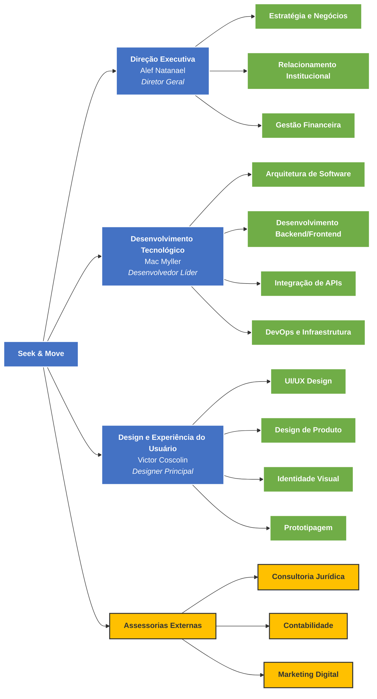

# Planejamento Estratégico - Seek & Move

## 1. Apresentação da Empresa

### 1.1 O que é a Seek & Move

A **Seek & Move** é uma startup de tecnologia especializada no desenvolvimento de soluções inteligentes para mobilidade urbana e análise de dados geoespaciais. Nossa empresa atua na criação de produtos tecnológicos que revolucionam a forma como pessoas e organizações interagem com o ambiente urbano.
<!-- 
### 1.2 Soluções Tecnológicas Específicas

#### 1.2.1 Produtos Principais:

**SeekMap Pro** - Plataforma de Análise Geoespacial
- Sistema de mapeamento e análise de riscos urbanos
- Ferramenta de visualização de dados geográficos em tempo real
- Módulos especializados: análise de tráfego, monitoramento ambiental, segurança urbana
- Interface web responsiva e aplicativo móvel

**MoveSafe** - Aplicativo de Mobilidade Inteligente
- Rotas otimizadas considerando segurança e eficiência
- Alertas de áreas de risco em tempo real
- Integração com transporte público e serviços de mobilidade
- Sistema de pontuação de segurança para trajetos

**UrbanInsights** - Dashboard Executivo para Gestão Pública
- Painéis de controle para tomada de decisão em mobilidade urbana
- Relatórios automatizados sobre fluxo de tráfego e padrões de mobilidade
- Integração com dados governamentais e sensores urbanos
- Módulo de previsão e simulação de cenários

**RiskAlert API** - Serviços de Dados como Produto
- API para integração de dados de risco geoespacial
- Serviços de notificação em tempo real
- Webhooks personalizáveis para sistemas terceiros
- Licenciamento de dados processados -->

### 1.2 Quem são os Sócios

**Alef Natanael** - Sócio Fundador (33.3%)

- Formação: Ciência da Computação
<!-- - Experiência: Gestão de projetos de tecnologia, liderança de equipes multidisciplinares. -->
- Responsabilidade: Direção geral e estratégia

**Mac Myller** - Sócio Fundador (33.4%)

- Formação: Ciência da Computação
<!-- - Experiência: desenvolvimento de sistemas, integração e entrega contínua (CI/CD) -->
- Responsabilidade: CTO e desenvolvimento tecnológico

**Victor Coscolin** - Sócio Fundador (33.3%)

- Formação: Ciência da Computação
<!-- - Experiência: Design de interfaces e experiência do usuário (UI/UX), com foco em aplicações web e mobile.  -->
  <!-- Conhecimento em design thinking, prototipagem e identidade visual para produtos tecnológicos. -->
- Responsabilidade: Chief Design Officer

### 1.3 Organograma da Empresa

### 1.4 Diferencial Tecnológico Específico

1. **Interface Humanizada**: Combinamos tecnologia avançada com design centrado no usuário, tornando dados complexos acessíveis e fáceis de aplicar na tomada de decisão.

2. **Integração Multiplataforma**: Nossos produtos se integram facilmente com sistemas existentes através de APIs robustas e bem documentadas.

3. **Modelo Híbrido SaaS + Consultoria**: Oferecemos tanto produtos tecnológicos quanto suporte consultivo especializado.

<!-- 
4. **Algoritmos Proprietários de Análise de Risco**: Desenvolvemos algoritmos únicos que combinam dados geoespaciais, histórico de incidentes e variáveis ambientais para gerar scores de risco precisos.

5. **Processamento em Tempo Real**: Nossa arquitetura permite o processamento e análise de grandes volumes de dados geoespaciais em tempo real, oferecendo atualizações instantâneas. 
-->

---

## 2. Missão, Visão e Valores

### 2.1 Missão

Desenvolver e fornecer soluções tecnológicas inovadoras em análise geoespacial e mobilidade urbana que capacitem governos, empresas e cidadãos a tomar decisões mais seguras e eficientes, promovendo cidades mais inteligentes e sustentáveis através da democratização do acesso a dados geográficos precisos e atualizados.

### 2.2 Visão

Ser a principal referência em tecnologia geoespacial aplicada à mobilidade urbana na América Latina até 2030, reconhecida pela inovação em análise de dados, excelência no atendimento e impacto positivo na qualidade de vida urbana, expandindo nossa atuação para pelo menos 5 países da região.

### 2.3 Valores

- **Inovação Tecnológica**: Buscamos constantemente novas tecnologias e metodologias para aprimorar nossos produtos e serviços.
- **Precisão de Dados**: Comprometemo-nos com a qualidade, veracidade e atualização constante das informações que fornecemos.
- **Impacto Social**: Desenvolvemos soluções que contribuem para cidades mais seguras, eficientes e sustentáveis.
- **Colaboração**: Valorizamos parcerias estratégicas e o trabalho em equipe para alcançar objetivos comuns.
- **Transparência**: Mantemos comunicação clara e ética com clientes, parceiros e colaboradores.
- **Agilidade**: Adaptamo-nos rapidamente às mudanças do mercado e necessidades dos clientes.
- **Excelência Técnica**: Priorizamos a qualidade técnica em todos os aspectos de desenvolvimento e entrega.

---

## 3. Diagnóstico Estratégico

### 3.1 Análise Interna

#### 3.1.1 Recursos Humanos

**Pontos Fortes:**

- Equipe técnica especializada com competências complementares
- Mac Myller: Expertise em desenvolvimento full-stack, arquitetura de sistemas e tecnologias geoespaciais
- Victor Coscolin: Experiência em design de produto e UX para aplicações técnicas
- Alef Natanael: Visão estratégica e capacidade de gestão empresarial

**Pontos Fracos:**

- Equipe reduzida (apenas 3 membros)
- Necessidade de contratação de especialistas em vendas e marketing
- Falta de expertise interna em análise financeira avançada

#### 3.1.2 Recursos Tecnológicos

**Pontos Fortes:**

- Stack tecnológico moderno e escalável
<!-- - Conhecimento em tecnologias geoespaciais (GIS, sensoriamento remoto) -->
- Capacidade de desenvolvimento tanto web quanto mobile
- Infraestrutura cloud-first

**Pontos Fracos:**

- Dependência de fornecedores externos
- Necessidade de investimento em infraestrutura de alto desempenho
- Falta de certificações técnicas específicas do setor

#### 3.1.3 Recursos Financeiros

**Pontos Fortes:**

- Baixo custo operacional inicial
- Modelo de receita diversificado (SaaS + consultoria + licenciamento)
- Potencial de escalabilidade com margem alta

**Pontos Fracos:**

- Capital inicial limitado
- Necessidade de investimento em marketing e vendas
- Tempo para retorno do investimento em desenvolvimento

#### 3.1.4 Capacidade Produtiva

**Pontos Fortes:**

- Metodologia ágil de desenvolvimento
- Produtos escaláveis digitalmente
- Capacidade de customização rápida

**Pontos Fracos:**

- Limitação de capacidade com equipe atual
- Dependência de poucos desenvolvedores-chave
- Necessidade de processos mais estruturados

#### 3.1.5 Vantagens Competitivas

<!-- - **Especialização Dupla**: Combinação única de expertise em mobilidade urbana e análise geoespacial -->
- **Agilidade de Startup**: Capacidade de resposta rápida às demandas do mercado
- **Modelo Híbrido**: Combinação de produto e serviço oferece flexibilidade aos clientes
- **Foco Regional**: Conhecimento das necessidades urbanas brasileiras

### 3.2 Análise Externa

#### 3.2.1 Mercado de Mobilidade Urbana

**Oportunidades:**

<!-- - Mercado global de smart cities projetado para US$ 2,5 trilhões até 2025 -->
- Crescente digitalização dos serviços públicos municipais
- Demanda por soluções de mobilidade sustentável
- Programas governamentais de incentivo à inovação urbana
- Expansão do conceito de cidades inteligentes no Brasil

**Ameaças:**

<!-- - Entrada de grandes players tecnológicos (Google, Microsoft, IBM) -->
- Dependência de políticas públicas e orçamentos governamentais
- Regulamentações restritivas sobre uso de dados pessoais
- Instabilidade econômica afetando investimentos públicos

#### 3.2.2 Concorrentes Diretos e Indiretos

**Concorrentes Diretos:**

<!-- - **Aquiris Game Studio**: Soluções de simulação urbana -->
<!-- - **Movile**: Plataforma de mobilidade (vendida para Prosus) -->
- **Consultorias locais**: Empresas de engenharia com serviços GIS

**Concorrentes Indiretos:**

- **Google Maps**: Dominância em navegação e dados geográficos
- **Waze**: Especialização em tráfego em tempo real
- **Moovit**: Foco em transporte público
<!-- - **ESRI**: Líder mundial em software GIS -->

#### 3.2.3 Legislação Específica

**Oportunidades:**

- Lei Geral de Proteção de Dados (LGPD) favorece empresas com práticas seguras
- Marco Legal das Startups oferece benefícios fiscais
- Política Nacional de Mobilidade Urbana incentiva inovação

**Ameaças:**

- Complexidade regulatória para acesso a dados públicos
- Necessidade de conformidade rigorosa com LGPD
- Mudanças nas leis de licitação pública

#### 3.2.4 Tendências Tecnológicas

**Oportunidades:**

- Internet das Coisas (IoT) expandindo dados urbanos disponíveis
- Inteligência Artificial democratizando análise de big data
- 5G possibilitando aplicações em tempo real
- Edge computing reduzindo latência
- Blockchain para segurança de dados

#### 3.2.5 Necessidades Urbanas Específicas

**Oportunidades:**

- Crescimento populacional urbano no Brasil
- Necessidade de otimização do transporte público
- Demanda por segurança urbana baseada em dados
- Pressão por sustentabilidade ambiental
- Exigência de transparência na gestão pública

### 3.3 Matriz SWOT

| **FORÇAS (Strengths)** | **FRAQUEZAS (Weaknesses)** |
|------------------------|----------------------------|
| • Agilidade de startup | • Equipe reduzida (apenas 3 membros) |
| • Modelo híbrido produto/serviço | • Capital inicial limitado |
| • Foco regional no mercado brasileiro | • Dependência de fornecedores de dados |
| • Capacidade de resposta rápida | • Falta de expertise em vendas |
| • Flexibilidade aos clientes | • Processos ainda não estruturados |
| • Conhecimento das necessidades urbanas locais | • Necessidade de certificações técnicas |

| **OPORTUNIDADES (Opportunities)** | **AMEAÇAS (Threats)** |
|------------------------|----------------------------|
| • Digitalização dos serviços públicos municipais | • Dependência de políticas públicas e orçamentos |
| • Demanda por soluções de mobilidade sustentável | • Regulamentações restritivas sobre dados pessoais |
| • Programas governamentais de incentivo à inovação | • Instabilidade econômica afetando investimentos |
| • Expansão de cidades inteligentes no Brasil | • Competição com Google Maps/Waze |
| • IoT expandindo dados urbanos disponíveis | • Complexidade regulatória para acesso a dados |
| • IA democratizando análise de big data | • Mudanças nas leis de licitação pública |
| • 5G possibilitando aplicações em tempo real | • Competição com Moovit no transporte público |
| • Crescimento populacional urbano | • Necessidade de conformidade rigorosa com LGPD |
| • Marco Legal das Startups (benefícios fiscais) | • Consultorias locais com serviços GIS |

---

## 4. Cenários

### 4.1 Cenário Otimista (Probabilidade: 30%)

**Contexto**: Economia estável, investimentos públicos em smart cities, adoção acelerada de tecnologia.

**Características**:

- Crescimento do PIB acima de 3% ao ano
- Aumento de 50% nos investimentos municipais em tecnologia
- Aprovação de marco regulatório favorável para startups de dados
- Expansão do 5G para 80% das cidades brasileiras

**Impactos para a Seek & Move**:

- Crescimento de receita de 200% ao ano
- Expansão para 5 estados em 2 anos
<!-- - Captação de investimento série A de R$ 2 milhões -->
- Equipe expandida para 15 colaboradores

### 4.2 Cenário Realista (Probabilidade: 50%)

**Contexto**: Crescimento moderado, digitalização gradual do setor público, competição crescente.

**Características**:

- Crescimento do PIB entre 1-2% ao ano
- Investimentos municipais em tecnologia crescendo 20% ao ano
- Regulamentação estável mas complexa
- Expansão gradual do 5G

**Impactos para a Seek & Move**:

- Crescimento de receita de 80-100% ao ano
- Consolidação no mercado regional (CE, AL, BA, PB)
<!-- - Bootstrapping ou investimento anjo de R$ 500 mil -->
- Equipe expandida para 8-10 colaboradores

### 4.3 Cenário Pessimista (Probabilidade: 20%)

**Contexto**: Recessão econômica, cortes orçamentários públicos, regulamentação restritiva.

**Características**:

- PIB negativo ou estagnado
- Redução de 30% nos investimentos públicos
- Regulamentação restritiva para uso de dados
- Atraso na implementação de tecnologias

**Impactos para a Seek & Move**:

- Crescimento de receita de 20-30% ao ano
- Foco no mercado privado (B2B)
<!-- - Necessidade de pivô para soluções mais acessíveis -->
- Manutenção da equipe atual com consultoria externa

---

## 5. Postura Estratégica da Empresa

### 5.1 Postura Estratégica Adotada: **CRESCIMENTO DIVERSIFICADO**

Com base na análise SWOT e cenários projetados, a Seek & Move adotará uma postura de **crescimento diversificado**, combinando:

1. **Desenvolvimento de Produto** (40% do foco):
   - Aprimoramento contínuo das soluções existentes
   - Desenvolvimento de novos módulos e funcionalidades
   - Investimento em pesquisa e desenvolvimento

2. **Penetração de Mercado** (35% do foco):
   - Expansão da base de clientes no mercado atual
   - Fortalecimento da presença regional
   - Otimização de processos comerciais

3. **Desenvolvimento de Mercado** (20% do foco):
   - Expansão geográfica para novos estados
   - Exploração de novos segmentos de clientes
   - Parcerias estratégicas

4. **Diversificação Relacionada** (5% do foco):
   - Exploração de aplicações adjacentes da tecnologia
   - Novos modelos de monetização
   - Serviços complementares

### 5.2 Justificativa da Postura

Esta postura é adequada porque:

- Maximiza as forças internas (tecnologia e agilidade)
- Aproveita as oportunidades do mercado em crescimento
- Mitiga as fraquezas através do crescimento sustentável
- Reduz riscos através da diversificação de receitas

---

## 6. Objetivos

### 6.1 Objetivos da Empresa

#### 6.1.1 Objetivos Estratégicos (2025-2027)

1. **Crescimento de Receita**: Alcançar R$ 2 milhões em receita anual recorrente até dezembro de 2027
2. **Expansão Geográfica**: Estabelecer presença em 5 estados brasileiros
3. **Base de Clientes**: Atingir 50 clientes ativos (20 públicos, 30 privados)
4. **Produto**: Lançar 3 novos produtos/módulos por ano
5. **Equipe**: Expandir para 15 colaboradores especializados
6. **Financeiro**: Captação de R$ 1 milhão em investimento

#### 6.1.2 Objetivos Operacionais (2025)

1. **Vendas**: Fechar 15 novos contratos
2. **Marketing**: Alcançar 10.000 seguidores nas redes sociais
3. **Parcerias**: Estabelecer 5 parcerias estratégicas
4. **Certificação**: Obter certificação ISO 27001 (Segurança da Informação)
5. **Team Building**: Contratar 3 novos colaboradores
<!-- 2. **Desenvolvimento**: Lançar versão 2.0 do SeekMap Pro -->

### 6.2 Objetivos Funcionais

#### 6.2.1 Área de Desenvolvimento (Mac Myller)

**Objetivos 2025**:

- Implementar arquitetura de microserviços para escalabilidade
- Desenvolver API pública com documentação completa
- Alcançar 99.9% de uptime dos sistemas
<!-- - Reduzir tempo de resposta das consultas em 50% -->
- Implementar sistema de machine learning para análise preditiva

**Métricas**: Tempo de resposta, disponibilidade, bugs por release, velocidade de desenvolvimento

#### 6.2.2 Área de Design (Victor Coscolin)

**Objetivos 2025**:

- Planejar interfaces com foco em acessibilidade
- Criar sistema de design unificado para todos os produtos
- Alcançar NPS de 8+ em usabilidade
- Desenvolver prototótipos de 2 novos produtos
- Estabelecer processo de design thinking

**Métricas**: NPS de usabilidade, tempo de tarefa dos usuários, taxa de adoção de funcionalidades

#### 6.2.3 Área de Negócios (Alef Natanael)

**Objetivos 2025**:

- Alcançar R$ 500.000 em receita anual
- Estabelecer 3 parcerias estratégicas
- Desenvolver processo estruturado de vendas B2B
- Criar programa de fidelização de clientes
- Participar de 5 eventos do setor

**Métricas**: Receita, número de clientes, taxa de churn,  ticket médio, conversão de leads 

---

## 7. Estratégias da Empresa

### 7.1 Estratégias de Crescimento

#### 7.1.1 Estratégia de Produto

**"Platform as a Service" (PaaS) Especializada**

- Desenvolvimento de plataforma modular que permita customização
- APIs abertas para integração com sistemas terceiros
- Marketplace de módulos especializados
- Modelo de subscription com diferentes tiers

**Ações Específicas**:

- Refatorar arquitetura atual para modelo de plataforma
- Criar SDK para desenvolvedores externos
- Implementar sistema de billing automatizado
- Desenvolver portal self-service para clientes

#### 7.1.2 Estratégia de Mercado

**"Land and Expand" no Setor Público**

- Entrada com projetos piloto de baixo custo
- Demonstração de valor através de cases de sucesso
- Expansão gradual para contratos maiores
- Referências para novos municípios

**Ações Específicas**:

- Criar pacote "Starter" para prefeituras pequenas
- Desenvolver programa de parcerias com consultorias
- Investir em marketing de conteúdo técnico
- Participar de eventos e licitações estratégicas

#### 7.1.3 Estratégia de Inovação

**"Open Innovation" com Ecossistema**

- Parcerias com universidades para P&D
- Colaboração com startups complementares
- Participação em aceleradoras e incubadoras
- Hackathons e challenges de inovação

**Ações Específicas**:

- Estabelecer parceria com 2 universidades
- Aderir a programa de aceleração corporativa
- Organizar hackathon anual sobre mobilidade urbana
- Criar programa de estágio em inovação

### 7.2 Estratégias Competitivas

#### 7.2.1 Diferenciação por Especialização

**Foco no Mercado Brasileiro e Latino-americano**

- Conhecimento profundo das necessidades locais
- Customização para regulamentações regionais
- Suporte em português com atendimento humanizado
- Cases específicos para realidade urbana local

#### 7.2.2 Estratégia de Nicho

**Especialização em Segmentos Específicos**

- Foco inicial em prefeituras de médio porte (100-500 mil habitantes)
- Especialização em empresas de logística e transporte
- Nicho de ONGs e organizações ambientais
- Segmento de empresas de construção civil

#### 7.2.3 Estratégia de Parcerias

**Ecossistema de Valor**

- Integração com ERPs governamentais (Betha, Procempa)
- Parcerias com consultorias de engenharia
- Alianças com fornecedores de dados (sensores, satélites)
- Channel partners em outros estados

### 7.3 Estratégias de Sustentabilidade

#### 7.3.1 Modelo de Receita Recorrente

- **SaaS Subscriptions** (60% da receita): Assinaturas mensais/anuais
- **Professional Services** (25% da receita): Consultoria e implementação
- **Data Licensing** (10% da receita): Licenciamento de dados processados
- **Training & Certification** (5% da receita): Cursos e certificações

#### 7.3.2 Eficiência Operacional

- Automação máxima de processos repetitivos
- Infraestrutura cloud com auto-scaling
- Metodologias ágeis para desenvolvimento
- Outsourcing de atividades não-core

---

## 8. Política Empresarial

### 8.1 Política de Qualidade

**Compromisso**: Entregar soluções tecnológicas que superem as expectativas dos clientes em precisão, usabilidade e confiabilidade.

**Diretrizes**:

- Todos os produtos passam por testes automatizados e revisão por pares
- Documentação técnica obrigatória para todas as funcionalidades
- Processo de feedback contínuo com clientes
- Métricas de qualidade acompanhadas semanalmente
- Certificação de qualidade de dados (precisão > 95%)

### 8.2 Política de Atendimento ao Cliente

**Compromisso**: Proporcionar experiência excepcional através de atendimento técnico especializado e suporte proativo.

**Diretrizes**:

- SLA de resposta: 4 horas para crítico, 24 horas para demais
- Suporte técnico especializado incluído em todas as assinaturas
- Treinamento gratuito para equipes dos clientes
- Account manager dedicado para clientes enterprise
- Pesquisa de satisfação trimestral (meta: NPS > 70)

### 8.3 Política de Inovação

**Compromisso**: Manter-se na vanguarda tecnológica através de investimento contínuo em pesquisa e desenvolvimento.

**Diretrizes**:

- 20% do tempo de desenvolvimento dedicado à inovação
- Orçamento mínimo de 15% da receita em P&D
- Participação em pelo menos 3 eventos técnicos por ano
- Programa de capacitação técnica para toda equipe
- Processo estruturado de avaliação de novas tecnologias

### 8.4 Política de Dados e Privacidade

**Compromisso**: Garantir máxima segurança e privacidade dos dados confiados pelos clientes, em conformidade total com a LGPD.

**Diretrizes**:

- Criptografia end-to-end para todos os dados sensíveis
- Auditoria de segurança semestral por empresa externa
- Treinamento obrigatório em LGPD para todos colaboradores
- Política de retenção de dados claramente definida
- Processo transparente de consentimento e portabilidade

### 8.5 Política de Sustentabilidade

**Compromisso**: Contribuir para o desenvolvimento sustentável através de tecnologia que promova cidades mais eficientes e ambientalmente responsáveis.

**Diretrizes**:

- Infraestrutura cloud com certificação de energia renovável
- Produtos que comprovadamente reduzam emissões urbanas
- Parcerias prioritárias com fornecedores sustentáveis
- Relatório anual de impacto social e ambiental
- Participação em iniciativas de smart cities sustentáveis

### 8.6 Política de Desenvolvimento Humano

**Compromisso**: Criar ambiente de trabalho que promova crescimento profissional, inovação e bem-estar dos colaboradores.

**Diretrizes**:

- Programa de desenvolvimento individual para cada colaborador
- Orçamento anual de R$ 3.000 por pessoa para capacitação
- Política de trabalho híbrido e flexibilidade de horários
- Profit sharing baseado em resultados coletivos
- Feedback 360º semestral para todos os níveis

---

## 9. Projetos e Planos de Ação

### 9.1 Projeto 1: SeekMap Pro 2.0 (Prioridade Alta)

**Objetivo**: Relançar plataforma principal com arquitetura escalável e novas funcionalidades

**Escopo**:

- Migração para arquitetura de microserviços
- Interface redesenhada com foco em usabilidade
- Módulo de machine learning para análise preditiva
- API pública com documentação completa
- Dashboard executivo para tomadores de decisão

**Cronograma**: Janeiro a Junho 2025 (6 meses)

**Orçamento**: R$ 120.000

- Desenvolvimento: R$ 80.000
- Design: R$ 25.000
- Infraestrutura: R$ 10.000
- Marketing: R$ 5.000

**Responsáveis**:

- Líder: Mac Myller
- Design: Victor Coscolin
- Negócios: Alef Natanael

**Entregas Principais**:

- Milestone 1 (Fev): Arquitetura técnica definida
- Milestone 2 (Mar): Protótipo funcional
- Milestone 3 (Abr): Beta com clientes selecionados
- Milestone 4 (Mai): Versão release candidate
- Milestone 5 (Jun): Lançamento oficial

### 9.2 Projeto 2: Expansão Comercial Regional (Prioridade Alta)

**Objetivo**: Estabelecer presença comercial em São Paulo e Rio de Janeiro

**Escopo**:

- Análise de mercado nos estados-alvo
- Desenvolvimento de parcerias locais
- Campanha de marketing regional
- Processo comercial estruturado
- Primeiros contratos assinados

**Cronograma**: Março a Dezembro 2025 (10 meses)

**Orçamento**: R$ 80.000

- Marketing e vendas: R$ 50.000
- Viagens e eventos: R$ 15.000
- Parcerias: R$ 10.000
- Consultoria comercial: R$ 5.000

**Responsáveis**:

- Líder: Alef Natanael
- Suporte técnico: Mac Myller
- Material comercial: Victor Coscolin

**Entregas Principais**:

- Milestone 1 (Mar): Pesquisa de mercado concluída
- Milestone 2 (Mai): 3 parcerias estabelecidas
- Milestone 3 (Jul): Campanha de marketing lançada
- Milestone 4 (Set): Primeiros leads qualificados
- Milestone 5 (Dez): 5 contratos assinados

### 9.3 Projeto 3: MoveSafe Mobile App (Prioridade Média)

**Objetivo**: Lançar aplicativo mobile para usuários finais

**Escopo**:

- Aplicativo nativo para iOS e Android
- Funcionalidades de navegação segura
- Sistema de gamificação
- Integração com redes sociais
- Monetização através de freemium

**Cronograma**: Julho 2025 a Janeiro 2026 (7 meses)

**Orçamento**: R$ 100.000

- Desenvolvimento mobile: R$ 70.000
- Design UI/UX: R$ 20.000
- Marketing de lançamento: R$ 10.000

**Responsáveis**:

- Líder: Mac Myller
- Design: Victor Coscolin
- Go-to-market: Alef Natanael

### 9.4 Projeto 4: Certificação e Compliance (Prioridade Média)

**Objetivo**: Obter certificações técnicas e de segurança para credibilidade no mercado

**Escopo**:

- Certificação ISO 27001 (Segurança da Informação)
- Conformidade total com LGPD
- Certificação de qualidade de dados
- Auditoria de segurança por terceiros
- Documentação de processos

**Cronograma**: Agosto 2025 a Fevereiro 2026 (7 meses)

**Orçamento**: R$ 60.000

- Consultoria especializada: R$ 35.000
- Auditoria externa: R$ 15.000
- Certificações: R$ 10.000

**Responsáveis**:

- Líder: Alef Natanael
- Técnico: Mac Myller

### 9.5 Projeto 5: Centro de Inovação (Prioridade Baixa)

**Objetivo**: Estabelecer centro de pesquisa e desenvolvimento em parceria com universidade

**Escopo**:

- Parceria com universidade local
- Laboratório de inovação em mobilidade
- Programa de estágio e iniciação científica
- Pesquisa aplicada em IA e mobilidade
- Publicações científicas

**Cronograma**: Janeiro a Dezembro 2026 (12 meses)

**Orçamento**: R$ 150.000

- Infraestrutura do lab: R$ 80.000
- Bolsas e salários: R$ 50.000
- Equipamentos: R$ 20.000

---

## 10. Controle e Avaliação do Planejamento

### 10.1 Sistema de Indicadores (KPIs)

#### 10.1.1 Indicadores Financeiros

| KPI | Meta 2025 | Frequência | Responsável |
|-----|-----------|------------|-------------|
| Receita Recorrente Anual (ARR) | R$ 500.000 | Mensal | Alef Natanael |
| Margem Bruta | 75% | Mensal | Alef Natanael |
| Ticket Médio | R$ 15.000 | Mensal | Alef Natanael |
| Taxa de Churn | < 5% | Mensal | Alef Natanael |
| Customer Acquisition Cost (CAC) | < R$ 2.000 | Mensal | Alef Natanael |
| Lifetime Value (LTV) | > R$ 50.000 | Trimestral | Alef Natanael |

#### 10.1.2 Indicadores Operacionais

| KPI | Meta 2025 | Frequência | Responsável |
|-----|-----------|------------|-------------|
| Uptime dos Sistemas | 99.9% | Diário | Mac Myller |
| Tempo de Resposta da API | < 200ms | Semanal | Mac Myller |
| Bugs por Release | < 5 | Por release | Mac Myller |
| Velocidade de Desenvolvimento | 30 story points/sprint | Sprint | Mac Myller |
| Net Promoter Score (NPS) | > 70 | Trimestral | Victor Coscolin |
| Taxa de Adoção de Features | > 60% | Mensal | Victor Coscolin |

#### 10.1.3 Indicadores de Crescimento

| KPI | Meta 2025 | Frequência | Responsável |
|-----|-----------|------------|-------------|
| Número de Clientes Ativos | 25 | Mensal | Alef Natanael |
| Leads Qualificados | 10/mês | Mensal | Alef Natanael |
| Taxa de Conversão | 20% | Mensal | Alef Natanael |
| Expansão de Receita | 30% | Trimestral | Alef Natanael |
| Market Share Regional | 15% | Semestral | Alef Natanael |

### 10.2 Metodologia de Controle

#### 10.2.1 Reuniões de Acompanhamento

**Reuniões Diárias (Daily Stand-ups)**:

- Duração: 15 minutos
- Participantes: Toda equipe
- Foco: Progresso, impedimentos, próximos passos
- Ferramenta: Presencial ou videoconferência

**Reuniões Semanais (Weekly Review)**:

- Duração: 1 hora
- Participantes: Líderes de área
- Foco: KPIs, análise de tendências, decisões
- Ferramenta: Dashboard executivo

**Reuniões Mensais (Monthly Business Review)**:

- Duração: 2 horas
- Participantes: Toda equipe + assessores
- Foco: Resultados do mês, planejamento próximo período
- Ferramenta: Apresentação executiva

**Reuniões Trimestrais (Quarterly Review)**:

- Duração: 4 horas
- Participantes: Equipe + stakeholders externos
- Foco: Revisão estratégica, ajustes no planejamento
- Ferramenta: Workshop estruturado

#### 10.2.2 Ferramentas de Monitoramento

**Dashboard Executivo**:

- Plataforma: Power BI ou similar
- Atualização: Tempo real
- Acesso: Todos os líderes
- Visualizações: KPIs, tendências, alertas

**Sistema de CRM**:

- Plataforma: HubSpot ou Pipedrive
- Função: Acompanhar pipeline comercial
- Responsável: Alef Natanael
- Relatórios: Semanais

**Ferramentas de Desenvolvimento**:

- Plataforma: Jira + Confluence
- Função: Acompanhar desenvolvimento de produto
- Responsável: Mac Myller
- Métricas: Velocity, burn-down, qualidade

### 10.3 Processo de Avaliação e Ajustes

#### 10.3.1 Análise de Desvios

**Processo**:

1. Identificação automática de desvios > 10% das metas
2. Análise de causas raiz em 48 horas
3. Plano de ação definido em 1 semana
4. Implementação e acompanhamento

**Tipos de Desvio**:

- **Desvio Positivo**: Superação de metas (analisar para replicar)
- **Desvio Negativo Menor** (<20%): Ajustes táticos
- **Desvio Negativo Maior** (>20%): Revisão estratégica

#### 10.3.2 Ciclo de Melhoria Contínua

**Metodologia PDCA**:

- **Plan**: Planejamento baseado em dados
- **Do**: Execução monitorada
- **Check**: Verificação sistemática
- **Act**: Ações corretivas/preventivas

**Frequência de Revisão**:

- **Operacional**: Diária/Semanal
- **Tática**: Mensal
- **Estratégica**: Trimestral/Anual

### 10.4 Relatórios e Comunicação

#### 10.4.1 Relatório Mensal de Resultados

**Estrutura**:

1. Sumário executivo
2. Performance vs. metas
3. Destaques do período
4. Análise de tendências
5. Planos para próximo mês

**Distribuição**: Equipe, investidores, advisors

#### 10.4.2 Relatório Trimestral Estratégico

**Estrutura**:

1. Análise estratégica do mercado
2. Performance dos projetos principais
3. Evolução dos KPIs críticos
4. Riscos e oportunidades
5. Ajustes no planejamento
6. Projeções para próximo trimestre

**Distribuição**: Stakeholders principais

#### 10.4.3 Relatório Anual de Impacto

**Estrutura**:

1. Resultados vs. objetivos anuais
2. Impacto social e ambiental
3. Evolução da empresa
4. Lições aprendidas
5. Planejamento para ano seguinte

**Distribuição**: Público (website, redes sociais)

---

## Conclusão

O planejamento estratégico da Seek & Move foi desenvolvido com foco na especificidade das soluções tecnológicas oferecidas, atendendo ao feedback de refinar a proposta ampla inicialmente apresentada.

**Principais Diferenciais do Planejamento**:

1. **Especificidade Técnica**: Definição clara de 4 produtos principais (SeekMap Pro, MoveSafe, UrbanInsights, RiskAlert API) com características e funcionalidades detalhadas.

2. **Modelo de Negócio Diversificado**: Combinação estratégica de SaaS, consultoria, licenciamento de dados e serviços profissionais.

3. **Posicionamento de Nicho**: Foco específico no mercado brasileiro e latino-americano com conhecimento das necessidades locais.

4. **Estratégia de Crescimento Estruturada**: Abordagem "land and expand" com foco inicial em prefeituras de médio porte e expansão gradual.

5. **Sustentabilidade Financeira**: Modelo de receita recorrente com projeções realistas baseadas no cenário de mercado.

Este planejamento posiciona a Seek & Move como uma startup de tecnologia especializada e diferenciada no mercado de mobilidade urbana e análise geoespacial, com estratégias claras para crescimento sustentável e criação de valor para clientes e stakeholders.

A implementação deste planejamento deve ser acompanhada sistematicamente através dos KPIs definidos, com flexibilidade para ajustes conforme a evolução do mercado e da empresa.
